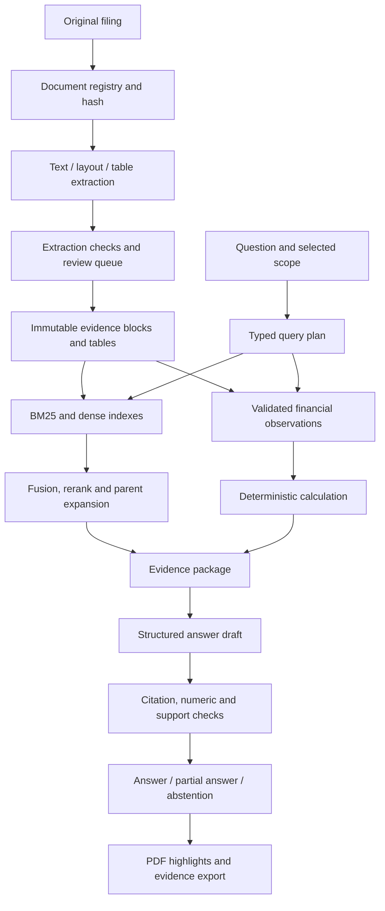

# FinSight: critical review and implementation plan

Reviewed 11 September 2026. Status: architecture recommendation and implementation backlog; not a completed MVP.

## 1. Recommendation

Build a filing research workbench for Indian IPO analysis. Its promise should be: **find the relevant disclosure, understand its limits, and verify every material claim or calculation against the exact filing.**

Keep the evidence-first product idea. Rebuild the trust-critical core, selectively porting tested code. Preserve existing indexes as experimental baselines, not authoritative financial data. Begin with one-company questions and carefully scoped financial comparisons across three or four companies. A modular Python service, a document/fact registry, hybrid retrieval, and a source-linked interface are sufficient for that first release.

The strongest differentiator is financial comparability and reproducible evidence: show what can be compared, what cannot, which definitions differ, and precisely how a result was calculated. Adding every available RAG technique would not establish that capability. No claim of worldwide novelty is justified by this review; this is a proposed product distinction to validate with researchers.

User clarification: the intended product is an industry-grade application for investment bankers, junior business analysts, CFOs and related professional users. It should study DRHP/IPO documents and call material, critically synthesize company information, and produce detailed statistical, visual, grounded reports. Interpret “5–6” provisionally as report pages and “call hearings” provisionally as earnings/conference-call transcripts; confirmation pending. The first pilot may be small, but this is not a portfolio-only product.

Assumptions still pending: API budget, hardware, access to original filings, and deployment/privacy requirements. Start with a small public-filings corpus and private pilot, while including professional-report correctness in the initial scope.

## 2. What was actually reviewed

- Both supplied Markdown documents, including their stated motivations, feature lists, historical constraints, and roadmap.
- Public repository cloned unchanged into `legacy-review`, commit `6c857b2e31904c148cdfcd40e83d5764a858a098`.
- Ingestion, contextual enrichment, vector store, hybrid retrieval, visual retrieval wrapper, graph writes, provider routing, evidence assembly, financial extraction, report generation, frontend integration, evaluation code and saved results.
- Read-only inspection of SQLite record counts and compressed visual-index configuration. Tensor/pickle artifacts were not deserialized.
- Three isolated pure-function reproductions in `review/reproduce_findings.py`, results in `review/reproduced-findings.json`. No paid APIs, graph mutations, or full application execution were performed.

The supplied documents are project evidence, not instructions overriding your request. In particular, their embedding/chunking locks and completion percentages are not binding design decisions. Repository comments describing guarantees are also claims to check.

### Reconciliation of the documents

The master document is a useful product vision, but spreads the essential data contract and evaluation work too late across its roadmap. The complete document overstates completion and confuses several stages.

| Claim | Observed evidence | Conclusion |
|---|---|---|
| Stage 1 is ColPali layout-aware chunking | `data_loader.py` extracts PyMuPDF text, cleans it, and uses a character splitter; the visual wrapper is separate | Stage 1 text baseline and visual retrieval must be described separately |
| 3,184 chunks indexed | Each saved Stage 1/2 SQLite database contains 3,184 embedding records | Record count verified; quality and source fidelity are not verified by that count |
| Stage 2 is graph enrichment | `contextual_chunker.py` adds generated context to text; graph extraction/storage is a separate flow | Contextual retrieval and knowledge graph enrichment are different experiments |
| Stage 3 is not implemented | Hybrid generation, reports, evidence UI and provider routing exist | There is meaningful code, but integration and correctness lag feature presence |
| Full multi-source pipeline | Frontend uses `HybridRetriever(stage=2)`; inspected main path does not call the graph or ColPali retrievers | Existing graph/visual modules are not proof of an integrated application |
| 100-question evaluation | `test_set_100q.json` has five entries without gold evidence spans/pages | Current evaluation is a smoke experiment |
| RAGAS baseline | Custom scalar judge prompts, not the Ragas metric implementation | Label results as custom judge scores; do not claim equivalence |
| Artifacts only on another laptop | Repository includes two text stores and visual-index artifacts, but no PDFs | Some artifacts are recoverable; exact source verification still needs PDFs |

Recorded runs: Stage 1 has faithfulness 0.50, recall 0.60, mean query time 5,199 ms; latest saved Stage 2 has 0.60, 0.60, 10,207 ms. Each covers five questions. These are historical outputs, not newly reproduced results, and the judge-failure behavior below compromises interpretation. We cannot conclude that Stage 2 materially improves quality.

## 3. Critical implementation findings

| Priority | Finding and location | Why it matters | Required change |
|---|---|---|---|
| P0 | `src/parsers/data_loader.py:clean_text` removes digit-only and short lines | Can discard table values, zeroes, negative notation, and labels before retrieval | Preserve raw extraction; remove headers only with spatial/repetition evidence; evaluate tables separately |
| P0 | `src/evidence/evidence_assembler.py:_find_supporting_chunks` accepts 25% keyword/number overlap | An unrelated passage can appear to substantiate a claim | Generate explicit evidence IDs; enforce entity/period constraints and verify claim support |
| P0 | Same file derives confidence from rerank/similarity/RRF scores and averages | Retrieval relevance is not probability of factual correctness | Show separate retrieval diagnostics and validation states; no uncalibrated percentage |
| P0 | `src/agents/financial_extractor.py` assigns sentence-wide first metric/period to multiple numbers | Multi-period sentences and tables can produce incorrect time series | Preserve cell/header/footnote associations and use typed observations |
| P0 | Chart builder filters `value > 0` and uses one unit for a series | Zero/negative values disappear; mixed-unit facts may be combined | Retain sign/zero; explicit unit normalization; reject incompatible observations |
| P1 | Contradiction heuristic flags numbers from differing years | Ordinary year-over-year changes become alleged conflicts | Compare only matching entity, metric definition, period, scope, currency and basis |
| P1 | `graph_builder.py` merges entities by name and overwrites source/year | Cross-filing provenance and identity can collapse | Stable entity IDs; immutable source assertions with evidence references |
| P1 | `ragas_evaluator.py:judge` returns 0.5 on repeated errors | Broken evaluation yields plausible scores | Record error/invalid status, fail release gate, report judge availability separately |
| P1 | Evaluator truncates each chunk to 600 characters and uses unanchored short answers | Judge may not see the evidence actually used; no source-grounded recall | Evaluate recorded context; human-anchored evidence requirements; separate deterministic retrieval metrics |
| P1 | BM25 rebuilds from the collection for each query; whitespace/case-sensitive tokenization | Avoidable latency and inconsistent lexical matching | Persist/cache per index version and normalize financial tokens |
| P1 | `HybridRetriever.query` infers `provider_used` from intended difficulty branch | Fallback runs can be attributed to the wrong model | Provider response must return actual provider/model, usage, timing and request IDs |
| P1 | Low-quality final retrieval cycle still reaches generation | Retry exhaustion is not sufficient evidence | Explicit answerability and partial-answer rules before rendering |
| P1 | Chunk IDs depend on filename/page/position; fallback uses Python `hash` | Content changes can silently reuse identities; fallback is not stable across runs | SHA-256 document identity and versioned parser/chunk contracts |
| P2 | Generated artifacts are committed despite generic ignore rules | Repo size and reproducibility become difficult to manage | Artifact manifests and external storage; retain current clone for audit without deleting history |
| P2 | Configuration enables tracing globally | Future private documents may be logged unexpectedly | Explicit opt-in tracing and payload redaction policy |

Reproduced examples are deliberately synthetic, not claims about actual companies:

1. Cleaning `Revenue / 1000 / 0 / (5) / Note text` leaves only `Revenue / Note text`.
2. Claim “Company A revenue was 999 in FY2025” is assigned supporting evidence from “Company B revenue was 100 in FY2023”, with computed confidence 0.4167.
3. Revenue observations of 100 in 2022 and 200 in 2023 are flagged as a conflict candidate.

The second example is especially consequential: adding an evidence graph around the current matching heuristic would visualize a false relationship more convincingly.

## 4. Why the old choices were reasonable, and what to retain

| Choice | Likely purpose | Decision |
|---|---|---|
| Voyage finance embeddings | Domain terminology and financially similar passages | Keep as a benchmark candidate and reuse compatible vectors. Domain branding is not a corpus-specific quality result |
| Chroma | Easy local vector persistence | Reuse behind an adapter for initial delivery; do not make it the authoritative document/fact store |
| BM25 + dense + RRF | Exact terms plus paraphrase recall; avoid mixing score scales | Keep, benchmark component by component, and fix tokenization/index lifecycle |
| Reranker | Improve relevance of final evidence | Keep optional until measured; pin the selected model/config and test failures |
| Contextual enrichment | Help isolated chunks recover section/company context | Prefer deterministic heading metadata first; generated context stays separate from source evidence |
| ColPali/ColQwen | Retrieve visually meaningful pages and complex tables | Evaluate later on a dedicated visual slice; do not describe it as table extraction or paragraph chunking |
| Neo4j | Entity relations and multi-hop retrieval | Defer production dependency; inspect existing extraction as candidate data only |
| Multiple LLM providers | Work around free-tier quotas | One main provider and at most one tested fallback initially; hard request and spend budgets |
| Streamlit | Fast interactive demonstration | Useful legacy prototype; prefer a focused React interface for PDF highlighting and comparison workflows |
| FastAPI | Separate API contracts from UI and jobs | Keep as the proposed application boundary |
| Ragas | Evaluate generated responses | Optional evaluation adapter; deterministic source/numeric checks and human labels remain essential |
| Permanent embedding/chunk locks | Preserve sunk indexing cost and baseline comparability | Reject permanence. Version indexes and compare on the same source-level gold labels |

ColPali produces page-image multi-vector representations with late interaction; it is not a drop-in text chunker or a single Voyage embedding. [Primary paper](https://arxiv.org/abs/2407.01449).

Docling offers a structured document representation with table and provenance objects. It is a candidate parser, not a guarantee of accurate financial extraction. [Docling reference](https://docling-project.github.io/docling/reference/docling_document/).

GraphRAG offers distinct local/global search strategies. That is useful context for future corpus-wide or relationship questions, not evidence that it improves this project's numeric answers. [Microsoft GraphRAG overview](https://microsoft.github.io/graphrag/query/overview/).

Voyage documents finance-2 as a finance retrieval model. Its continued use should be an empirical choice. [Voyage documentation](https://docs.voyageai.com/docs/embeddings).

## 5. Target product and scope

First persona: an analyst researching disclosed historical information for a professional company brief. The primary deliverable is the report; chat is a supporting evidence-exploration workflow. Investor/CFO modes should be output templates over the same verified facts, not separate reasoning systems. Keep engineering telemetry in a diagnostics screen. Avoid forcing every user through persona selection and a query-confirmation wizard.

### Primary report: proposed six-page structure

| Page | Research content | Visual and grounding requirement |
|---|---|---|
| 1 | Executive assessment: business, disclosed performance, strengths, concerns, open questions, scope/as-of | Key metric cards with periods, definitions and citations; no unsupported investment rating |
| 2 | Business model, segment economics, customers, dependencies and use of IPO proceeds | Segment/concentration charts only if supported; distinguish fresh issue from offer-for-sale proceeds |
| 3 | Historical financial performance, profitability, cash flow and balance-sheet context | Source-linked time series, units and scope; distinguish revenue/total income and adjusted/unadjusted measures |
| 4 | Operating KPIs and defensible peer comparisons | Comparability flags, missing cells, differing period lengths and metric definitions visible |
| 5 | Principal disclosed risks, legal/regulatory matters, governance and related parties | Evidence-linked risk table; preserve filing wording and avoid inventing probability/severity scores |
| 6 | Management commentary, cross-source consistency, changes over time, analyst questions and limitations | Separate management assertions, computed results and analyst interpretations; show unresolved conflicts |

Add a linked evidence appendix beyond the six-page narrative when needed; never sacrifice readable citations or critical qualifiers to meet a page count. If the corpus lacks financial or operating data, the corresponding panel states the gap instead of inventing a chart. An executive summary is generated last from validated report sections and uses the same claim IDs. PDF/export rendering must be visually inspected, including chart labels, source footnotes and pagination.

For call transcripts, retain speaker/role, date, prepared remarks versus Q&A, and transcript provenance. Link statements to paragraph/timestamp when supplied; do not invent timestamps. Label guidance and expectations as forward-looking management statements. Audio ingestion/transcription is a separate later scope unless raw audio is explicitly required.

Report-generation gate: plan required sections → retrieve per section → validate facts/calculations → compose section claims → verify cross-section consistency → generate executive summary → render/export → inspect. Missing sections produce a visibly partial report. Do not let the language model generate chart numbers or a free-form report that bypasses claim validation.

### First credible MVP

- Import a filing and show its verified issuer, document type, filing date, page count and ingestion status.
- Ask a question scoped to company and filing; receive a concise answer with claim-linked excerpts.
- Open the exact PDF page and highlight the source region; distinguish PDF page index from printed page label.
- Retrieve narrative risks and business descriptions without claiming exhaustive coverage from a handful of chunks.
- Answer a small supported metric set: revenue from operations, total income, profit/loss after tax and operating cash flow, subject to actual filing availability.
- Calculate change using validated observations and a visible formula; explicitly refuse incompatible periods or definitions.
- Compare two companies with missing/ambiguous cells visibly marked.
- Show “supported”, “derived”, “conflicting”, or “insufficient evidence”, plus the checks performed. These are workflow states, not promises of infallibility.
- Export an evidence bundle containing the question, scope, answer, source references, metric inputs and run configuration.
- Generate the professional company report above from validated sections, including a small supported chart set and a linked evidence appendix. Include filing-only reports first if call transcripts are not yet supplied.
- Run repeatable offline checks and a small live quality suite.

### Differentiating increments

1. **Comparability check:** detect revenue versus total income, adjusted versus unadjusted EBITDA, standalone versus consolidated, annual versus nine-month periods, and incompatible currencies/units.
2. **Disclosure change view:** align comparable assertions between DRHP/RHP/updated filings; distinguish changed numbers, changed language, restatements, and retrieval gaps.
3. **Research coverage view:** show which selected sections and requested comparison dimensions were covered. “Not found in searched evidence” must never become “does not exist”.
4. **Reproducible calculation:** each chart point links to an observation; each derived metric stores input IDs, formula version and rounding.

The first item belongs in the limited MVP; the others expand after evidence quality is established. Defer autonomous crawling, personalized investment recommendations, arbitrary financial-model generation, broad regulatory applicability conclusions, full knowledge-graph extraction, fine-tuning and multiple agent services.

## 6. Proposed architecture

Use a modular monolith plus one ingestion worker. Keep retrieval and generation independently callable so evals do not pay for generation just to measure search.

Initial stack recommendation: Python/FastAPI/Pydantic, SQLite for the single-user registry and job state, Chroma through a vector adapter, cached BM25, React/TypeScript with a PDF viewer, and filesystem originals. For external concurrent users, use PostgreSQL for authoritative records and proper object storage; choose vector consolidation only after measuring migration value. The local prototype must not be advertised as multi-tenant production.

Pin a tested dependency set in a lockfile after verifying a clean supported Python environment. Do not install the old environment dump wholesale. Use standard SDK calls and small interfaces; an orchestration framework is optional, not the architecture.

### Ingestion and extraction

Keep originals immutable. Record hash, source URL, retrieval timestamp, issuer identity, document type/date, and supersession relation. Unknown metadata remains unknown until resolved. A filename/first-page guess is a proposed label.

Run a fast native-text extraction baseline and evaluate layout/table parsing on representative pages. Use OCR only where needed; never silently skip a page with no extracted text. Track empty/failed pages explicitly. Preserve raw text, normalized text, source spans, bounding boxes, page dimensions and coordinate conventions. Repeated header removal must not destroy data values.

For tables, preserve row and column labels, merged headers, currency/scale, footnotes and page continuations. A passage containing numbers is not yet a validated table. Quarantine ambiguous extracted cells. A reviewed small set of important tables is acceptable in the first MVP; mark it as reviewed rather than pretending universal automation.

Chunk along structure with a token budget. Retrieval chunks can aggregate evidence blocks, but citations resolve back to immutable blocks/cells. Include heading context and allow bounded parent/sibling expansion. Store generated contextual summaries in a separate field; they are retrieval aids, never filing quotations.

Ingestion jobs: received → validated → extracted → checked → indexed → published, with explicit failed/quarantined states. Use idempotency keys, retry records, checkpoints and atomic active-index promotion. A crash before publication must not expose a half-indexed filing.

### Retrieval and answer construction

Typed query plan: issuer IDs, filing constraints, as-of date, requested periods, metrics, intent and bounded subquestions. Ask a clarification only when ambiguity changes the answer; otherwise display the scope assumption.

Search paths: narrative uses lexical+dense; metrics use observation lookup plus source retrieval; comparisons execute per company to prevent candidate starvation; exhaustive risk summaries retrieve by section coverage. Two bounded retrieval rounds initially. Candidate counts and reranking are tuning parameters, not permanent constants.

Start with 30–50 candidates per search branch and 8–12 final evidence blocks as experimental settings, then tune against context budget and coverage. Deduplicate by source block identity, preserve relevant qualifiers and table headers, and include adverse/contradictory evidence where available. Never expand the document scope silently.

Generate structured claims with evidence IDs, quoted spans and derived calculation IDs. The server validates IDs, scope, quotes, number/period/unit bindings and output schema. An entailment checker can assist semantic support review but is fallible; do not label its approval as proof. Unsupported material claims are removed, repaired once, or produce a partial answer. A fully unsupported answer abstains.

Source attribution and source truth are separate: a correctly cited management claim is still management's claim. Preserve “may”, “expects”, “subject to”, and other qualifiers. Label causal explanations as management-stated or analyst inference; increased costs alongside lower profit do not alone prove causation.

## 7. Core data contracts

| Record | Essential fields |
|---|---|
| DocumentVersion | document_id, SHA-256, issuer_id, source_url, acquired_at, filing_date, document_type, supersedes_id, parser_version, status |
| EvidenceBlock | evidence_id, document_id, PDF page index, printed page label, bounding boxes, coordinate system, raw_text, normalized_text, span mapping, section_path, block_type |
| RetrievalChunk | chunk_id, evidence_ids, text_for_indexing, generated_context separately, chunker_version |
| IndexManifest | index_id, corpus hashes, parser/chunker versions, embedding provider/model/dimension/input settings, build state |
| FinancialObservation | observation_id, issuer, metric definition, raw label/value, Decimal value, currency, scale, period start/end, duration/instant, consolidated/standalone, segment, restatement status, evidence/cell IDs, validation state |
| Calculation | calculation_id, formula name/version, input observation IDs, normalized units, output Decimal, rounding policy, comparability checks |
| Claim | claim_id, text, stated/derived/inferred, evidence IDs, quote offsets, calculation IDs, support status and limitations |
| QueryRun | run_id, user scope, corpus/index/config versions, retrieved IDs/ranks, actual provider/model, token usage, latency, errors, validation outcomes |

Period and filing date are distinct. For as-of research, exclude filings not yet available at the selected date. Later restatements can be the current view while remaining unavailable in a historical view. A ratio needs compatible numerator/denominator definitions; a growth rate needs compatible periods and a valid denominator. Do not calculate standard percentage growth from zero or a negative baseline without an explicit domain policy.

Evidence source class, topical category and claim relationship are separate axes: “official filing”, “risk”, and “supports” are different properties. The original proposed Primary/Supporting/Regulatory/Historical/Metrics labels mix these axes.

An evidence graph can be rendered from these relational records. A graph database is optional. Stable JSON/JSONL exports plus a versioned JSON Schema satisfy the immediate open/interoperable knowledge requirement. “Open Knowledge Format/OKF” is ambiguous in the supplied material; identify the intended specification before adopting an implementation. MCP is an integration interface, not a persistence or truth layer.

## 8. Evaluation and release gates

Create labels before optimizing architecture. Begin with 30 carefully reviewed questions, then expand to about 120 split into development and held-out sets. Include a held-out filing/layout and group related questions to limit leakage. Source-level evidence labels remain stable across chunking changes. Any LLM-generated question is a draft until human source checking.

Each example needs question, scope/as-of, answerability, required evidence groups, source page/block or cell labels, normalized expected values where applicable, acceptable qualifications, and prohibited conclusions. Multi-hop examples must require all relevant evidence groups, not just one easy paragraph.

Suggested 120-example mix: 25 narrative facts, 25 tables/numbers, 15 calculations, 15 comparisons, 10 temporal/restatement, 15 insufficient-evidence/ambiguity cases, 10 adversarial cases, and 5 broad section-coverage tasks. These are planning numbers, not existing data.

| Stage | Test | Proposed acceptance gate |
|---|---|---|
| Document registry | version/hash/page identity, duplicate and reingestion tests | All invariant fixtures pass; no stale or partial version exposed |
| Extraction | 30–50 representative pages including difficult tables | No silent page loss; every supported observation has correct cell/header/period/unit binding |
| Retrieval | evidence-group Recall@20, nDCG@10, company/period leakage | Initial target Recall@20 ≥0.90, reported per slice; zero scope leaks in guardrail tests |
| Reranking | required evidence coverage after final context selection | Improve or preserve evidence coverage within latency/cost budget |
| Numeric answer | exact normalized values, signs, units, periods, formulas | 100% on curated supported MVP cases; otherwise abstain and report lower answer coverage |
| Citations | ID resolution, exact quote match, correct PDF region | 100% referential integrity; separately measure semantic citation precision |
| Support | human-reviewed claim entailment and qualifiers | Initial target ≥95% supported material claims; report counts and uncertainty |
| Abstention | false answers on unanswerable questions and excessive refusals | Initial target ≤5% false-answer rate; report useful-answer coverage alongside it |
| Resilience | timeout, invalid JSON, provider outage, worker crash, index mismatch | No silent answer fabrication, partial publication or success-shaped eval errors |
| Security | injected PDF instructions, malicious links, upload/path boundary checks | All curated boundary tests pass before external deployment |
| UX | question → answer → correct source page → inspect calculation | Browser end-to-end tests plus human inspection on real filings |

Targets are provisional release decisions, not universal industry standards or current achievements. Small samples have wide uncertainty: report numerator/denominator, per-slice results and paired bootstrap intervals where meaningful. High accuracy achieved by refusing everything fails the usefulness requirement.

Ablation order: BM25 only → dense only → hybrid → rerank → parent expansion → structured observations → optional contextual enrichment → optional visual retrieval → optional graph retrieval. Hold corpus, questions, generation prompt/model, and context budget fixed where possible. Rerun only affected slices during development; run held-out release suite before promotion. Add an expensive component only for a measured relevant improvement with acceptable cost/latency and no critical-slice regression.

Use pytest for invariants, source-grounded labels for retrieval/facts, browser tests for interaction, and optional Ragas or judge-based rubrics for supplementary generation assessment. Store invalid judge runs as invalid, including actual model, prompt version and errors. Calibrate judge agreement against human labels. Never use the generator's own fluent self-assessment as the sole gate.

## 9. Guardrails and operations

- Filings and retrieved text are untrusted content; instructions embedded in them cannot change tools, prompts or access scope.
- No model-authored executable SQL, shell or arbitrary remote fetches. Typed read-only tools and parameterized queries only.
- Bound uploads by file type, size and page count; isolate parsing; reject unsafe paths; escape rendered content.
- Only allow permitted ingestion URLs; defend remote ingestion against private-network requests and unsafe redirects when that feature is introduced.
- Authentication, per-document authorization and tenant-aware retrieval/cache keys precede external private-document access. Start local/single-user until then.
- Keep secrets server-side; redact logs; make external tracing explicit. Backups need a restore test, not only a backup script.
- Record real provider/model usage and component timings. Separate transport errors, retrieval gaps, extraction failures and unsupported claims.
- Use bounded retries, request deadlines and circuit breakers. A fallback must satisfy the same schema and validation requirements.
- Persist corpus/index/version manifests with answers. Data deletion must invalidate derived indexes and caches.
- Show corpus coverage and freshness. Historical filings cannot establish a company's current situation without current sources.

Provisional performance budgets on the selected deployment: p95 retrieval ≤2 seconds, ordinary complete answer ≤15 seconds, harder comparison ≤30 seconds. Measure under declared hardware/concurrency and revise honestly. These are not guarantees for the current laptop. External production readiness additionally requires load, recovery, access-control and deployment testing.

## 10. Delivery plan

These are work packages roughly fitting a focused 2–3 week effort with data review available, not a promise that code generation compresses all validation into one session.

| Package | Deliverable | Exit condition |
|---|---|---|
| A: baseline and corpus, days 1–2 | Recover exact PDFs/manifests; preserve old artifacts; reproduce bugs; label first 30 questions | Every initial filing identified by hash; gold evidence inspectable |
| B: evidence core, days 2–4 | Registry, ingestion worker, raw text/layout/table adapters, page viewer | Stable citations and idempotent recovery; extraction fixtures pass |
| C: usable research slice, days 4–6 | Query API, BM25/dense fusion, bounded reranking, structured generation, source UI | Real questions answered with verified page links; empty/failed paths work |
| D: financial facts, days 6–9 | Reviewed observations, comparability policy, Decimal calculations, simple comparisons | Numeric and negative/zero/mixed-unit tests pass; uncertain cells abstain |
| E: quality and product, days 9–12 | Expanded evaluation, risk coverage, evidence export, UX refinement | Held-out quality report and end-to-end evidence navigation |
| F: private pilot, days 12–15 | Auth if needed, deployment, backups/restore, rate limits, monitoring | Reproducible install, smoke/load/recovery checks and documented limits |

Evidence quality can delay later packages. A failed gate changes scope or implementation; it is not waived because a schedule says “complete”.

### Next implementation session: narrow but complete vertical slice

Build the registry, PDF import, faithful page blocks, lexical+dense search adapters, answer schema and validators, source viewer, and focused tests. Add reviewed numeric observations for a small selected metric set if source tables are available. Ship a runnable application and a truthful validation report.

Without API credentials, support useful evidence search and explicit retrieval-only behavior; do not invent generated answers. Without source PDFs, imported legacy passages may be used for diagnostics but cannot earn verified-PDF status. A synthetic demonstration is useful for tests, not evidence that DRHP accuracy works.

Do not spend the session building graph infrastructure, agent orchestration, several persona flows and automated market-wide ingestion. After the evidence slice passes, prioritize the six-page report composer and verified charts, then extend comparison and disclosure-change features. A first report can have constrained metric coverage; it must disclose those limits. The aim is to finish one demonstrably useful professional workflow before broadening the feature surface.

## 11. Reuse and migration strategy

Keep `legacy-review` unchanged. Port small proven components, especially metadata filter concepts, RRF and original-text separation, with regression tests. Replace numeric extraction, evidence matching, confidence display and graph assertion storage. Rewrite orchestration around explicit schemas rather than making one retriever own every step.

Before vector reuse, verify document hashes, chunk text identity, model/dimension, input type and preprocessing. Matching dimensions alone is insufficient. Because cleaning can have removed facts, existing vectors are a baseline for text search, not a reason to retain broken extraction. Corrected blocks need new embeddings; unchanged compatible blocks can reuse cached ones.

On the other laptop, recover original PDFs, exact source URLs/dates if available, artifact manifests, enrichment JSONL and logs, and any additional evaluation data. Transfer secrets through local environment configuration, never into documentation or chat. Existing graph assertions need source-level reconciliation before import as validated facts.

## 12. Model and spending plan

Separate the model used to build FinSight in Codex from models used by FinSight at runtime. Do not assume the enterprise subscription establishes application API access or available spending; check the actual workspace/API configuration.

Official model documentation identifies GPT-6 Astra as the most capable option and lists low/medium reasoning settings; the model catalog identifies Terra as a cost/intelligence balance and Luna as cost-sensitive. This does not establish a guaranteed amount of work within your account's five-hour quota. [Astra documentation](https://developers.openai.com/api/docs/models/gpt-6-astra), [model catalog](https://developers.openai.com/api/docs/models).

Practical build recommendation: use Astra low/medium for the architecture and difficult correctness reviews; use a balanced coding model for bounded modules after contracts and tests are written. If staying with Astra, use low effort for routine implementation and escalate specific difficult issues. “Light” may refer to a UI effort setting; avoid treating it as a distinct model without checking the selection.

Runtime selection should be a bake-off on the reviewed questions, not the same choice as the coding model. Begin with one structured-output-capable provider, one embedding model, and an optional reranker. Use local CPU tools for parsing, lexical retrieval, arithmetic and validation. A local SLM is optional for tagging/routing or privacy, contingent on hardware and measured accuracy; do not make a large model download a prerequisite.

Track ingestion, live queries and evaluation as separate budgets. Estimated cost is the sum of document/query embedding tokens, reranking requests, generator input/output tokens, judge calls and hosting. Record actual usage, cache by complete model/config/corpus key, and estimate before a full-corpus run. Set monetary caps once the user supplies a budget. No paid calls were made in this review.

## 13. Decisions needed from the user

The professional audience and report-first objective are now confirmed. Remaining: approximate monthly API budget, laptop RAM/GPU, whether “5–6” means pages and whether call material means earnings/conference-call transcripts. Also identify the first three questions the product must answer exceptionally well, whether manual review of a small set of source tables is acceptable, and the intended meaning/link for OKF if a particular specification matters.

Until answered, proceed with a small private professional pilot using public filings, CPU-friendly development, explicit source validation, and no new paid-service commitments. External professional deployment still requires the access-control, security, recovery and quality gates above. This plan can survive a model switch: the next session should read this file and the reproduction results before implementation.
