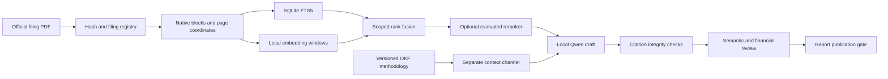

# FinSight RAG + OKF architecture

Decision record, 2026-09-16. Replaces the earlier keyword-only retrieval plan.
The product remains a source-grounded company research brief for professional
users. Qwen/Qwen3.6-35B-A3B remains the selected generation model. Fine-tuning
must improve measured behaviour without becoming the repository of company facts.

## Evidence flow

The diagram includes planned components: semantic review and final report
publication are not implemented. The current UI serves evidence and extractive
briefs. The Qwen adapter is opt-in through a CLI and returns review-required drafts.

## Tool choices and why

| Component | Implemented choice | Reason and boundary |
|---|---|---|
| Source registry | SQLite + original PDF files | Transactions and stable source identity; suitable for a local pilot |
| Native extraction | PyMuPDF subprocess | Page geometry and raw text; not a table interpreter or OCR engine |
| Keyword retrieval | SQLite FTS5 BM25 | Exact financial terms, names and abbreviations |
| Dense retrieval | FastEmbed 0.8.0 + ONNX Runtime, BGE-small-en-v1.5 | Downloaded, CPU-capable baseline for this approximately 32 GB laptop |
| Vectors | Normalized float32 blobs in SQLite | Exact scoped search, no ANN tuning errors in this small corpus |
| Fusion | Reciprocal rank fusion, constant 60 | Combines rankings without comparing incomparable raw scores |
| Rerank experiment | Xenova/ms-marco-MiniLM-L-6-v2 | Downloaded Apache-licensed ONNX candidate; evaluated separately |
| Knowledge layer | Canonical OKF v0.2 Markdown/YAML subset | Portable methodology with provenance, lifecycle and explicit trust declarations |
| Generation | Loopback HTTP Qwen adapter | Works with an OpenAI-compatible local server; no paid API or automatic server installation |
| Guardrails | Pydantic + deterministic application checks | Enforce actual evidence boundaries, not a generic safety score |
| Tests/evals | pytest + reproducible retrieval evaluator | Offline invariants plus visible real-source failure cases |

No LangChain/LlamaIndex dependency is necessary for this bounded pipeline. Add a
framework only when its ingestion/workflow functionality demonstrably reduces
maintenance. No graph database is needed to read linked OKF concepts. GraphRAG
becomes justified only when a labelled multi-hop question set shows missed
relations that ordinary scoped retrieval cannot recover.

Free software does not make rented GPUs, electricity or production operations
free. [PyMuPDF's AGPL/commercial dual licensing](https://pymupdf.readthedocs.io/en/latest/about.html#license-and-copyright) requires a distribution decision
before a proprietary commercial release. The embedded model and reranker have
separate weight licenses; keep upstream license files with deployment artifacts.
No commercial release or license suitability review has been completed.

## Current retrieval contract

1. Validate issuer/document scope before search. Unknown filing dates are excluded
   from date-bounded searches. User-entered filing dates do not establish public
   availability on that date.
2. Split blocks into 180-word windows with 30-word overlap, retaining exact spans.
   Return original block IDs and page coordinates, not synthetic window citations.
   Word windows are a baseline: subword token limits can still truncate unusual
   content. Heading-aware, token-budgeted chunks are a next-stage requirement.
3. Index original-source blocks only in the dense lane. Legacy cleaned text stays
   visibly unverified. Hash the evidence corpus; reject a stale dense index and
   expose lexical fallback instead of silently searching incomplete vectors.
4. Publish vectors and index metadata atomically after a complete build. Invalid
   embeddings or a concurrent corpus change leave the previous index intact.
5. Filter issuer/document/date before dense scoring. Merge a block's windows using
   maximum similarity, then fuse channel ranks. This is a relevance mechanism,
   not proof of an answer. Long-block and repeated-header ranking bias remain.
6. Reranking is an experiment, not automatically enabled because it is available.
   It currently uses bounded excerpt prefixes; relevant tails can be lost.

Exact scan and corpus-hash validation on every query deliberately favour
correctness at pilot scale. Larger corpora need versioned corpus snapshots,
cached matrices and a metadata-filtered vector service such as Qdrant, after
measuring latency and recall. Current index builds hold embeddings in memory.

## OKF contract

The format is Google's Open Knowledge Format, not an invented financial schema:
[canonical specification](https://github.com/GoogleCloudPlatform/open-knowledge-format/blob/main/SPEC.md).
The reader supports concepts, source IDs, generated/verified metadata, trust
declarations, status and staleness. Unknown fields are preserved. Reserved index
and log files are not treated as concepts. Missing footnote provenance makes a
concept ineligible for context retrieval. YAML aliases/anchors and duplicate
keys are rejected by FinSight's stricter application profile.

All loaded content is untrusted. A `human:` actor is merely a declaration; the
reader explicitly reports `verification_authenticated=false`. Seed methodology
is application-authored and unverified. A stable lifecycle flag is not expert
approval. Deprecated/stale/draft concepts are excluded from active context.

The current knowledge lane retrieves methodology lexically. It never supplies
issuer citations. It does not execute attested computations or follow URLs.
Full OKF conformance, authenticated reviews, relationship traversal and
source-linked issuer concept export remain future work.

## Generation and guardrails

The local adapter sends bounded filing excerpts and separately labelled
methodology to Qwen. It uses a loopback-only endpoint, disables proxy inheritance
and redirects, limits response bytes, requests structured JSON and validates the
schema. It has no tool executor. Empty evidence returns without a model call.

Every proposed claim is checked against the persisted source, retrieved IDs,
issuer, document and date scope. Fabricated quotes and legacy evidence fail.
An exact quotation can pass citation integrity; a paraphrase always remains
`needs_semantic_review`, even when its quote exists. No general entailment,
prompt-injection immunity or zero-hallucination guarantee is claimed. The draft
adapter has mocked tests but has not been exercised against a running Qwen model.

Financial computations stay in Decimal code. Future table observations must
bind row/column headers, unit, sign, period, accounting basis and footnotes.
Do not graph retrieved numbers or ask the LLM to calculate ratios directly.

## Next stages and release gates

### A. Retrieval foundation — current increment

Original filings, local embeddings, scoped hybrid retrieval, OKF methodology,
local Qwen adapter, guardrail tests and real-page smoke evaluation. Read
`stages/07_RAG_OKF_HANDOFF.md` for commands and remaining defects.

### B. Document structure and financial tables

Compare Docling and a maintained PDF/OCR alternative on the same 20 annotated
pages: portrait, landscape, multi-line headers, continuation tables, footnotes
and scanned pages. Retain both physical page and printed label. Evaluate cell
text, row/column association, sign, scale and period separately. A visually
correct page with wrong numerical binding fails. Never replace raw evidence.

### C. Retrieval selection

Build development and held-out questions across at least 5 issuers, withholding
entire filings. Include short queries, business synonyms, tables, duplicated
disclosures, absence questions, obsolete filings and adversarial instructions.
Annotate relevant evidence spans and acceptable alternative pages. Compare
BM25, BGE-small, BGE-M3 or a suitable larger embedding model, hybrid, and
rerankers. Measure evidence recall@k, nDCG, MRR, wrong-issuer/date leakage,
latency and memory. No model wins by leaderboard reputation alone.

### D. Qwen baseline and fine-tuning contract

Deploy on rented hardware only after verifying available memory and the chosen
runtime/quantization. Do not assume 3B active parameters mean 3B weight memory.
Measure untuned structured-output validity, faithful attribution, abstention,
numeric errors and prompt-injection susceptibility. Freeze company-disjoint
evaluation data before training. Synthetic examples are candidates, not gold
labels. With no finance reviewer, limit claims of professional analytical quality.

### E. Report and pilot

Build a claim ledger with source spans and computation receipts, then a six-page
report: business/offer, financial performance, operating drivers, risks and
governance, outlook/scenarios, open questions. Charts require approved numeric
observations. Verify page count and layout by rendering the final PDF. Pilot
release additionally requires authentication, tenant isolation, retention,
backup/recovery, dependency/license review and expert evaluation. Current
localhost protections are not a production security model.

## Sources for tooling decisions

* [FastEmbed repository](https://github.com/qdrant/fastembed)
* [BGE embedding model card](https://huggingface.co/BAAI/bge-small-en-v1.5)
* [ONNX reranker model](https://huggingface.co/Xenova/ms-marco-MiniLM-L-6-v2)
* [Qwen model card](https://huggingface.co/Qwen/Qwen3.6-35B-A3B)

These are upstream references, not evidence that any model meets FinSight's
financial quality requirements. The installed model snapshots should be pinned
and hash-audited before reproducible deployment; the index currently records
the logical model name and corpus/chunk fingerprints.
